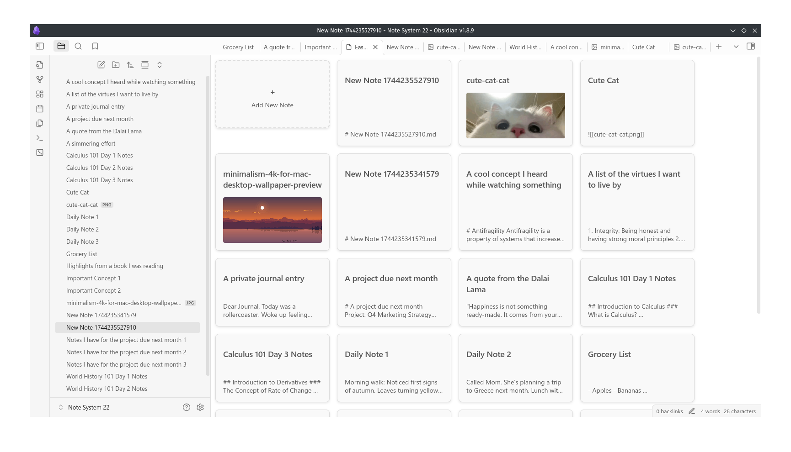

# Easy Keep View

**Easy Keep View** is a plugin that mimics the Google Keep interface, allowing you to view and manage your notes with image thumbnails and excerpts.

## Features

- Display notes in a card-like view with titles, excerpts, and optional image thumbnails.
- Easy-to-use interface inspired by Google Keep.
- Supports dark and light themes.
- Create new notes directly from the plugin view.

## Installation

1. Download the latest release from the GitHub repository.
2. Install the plugin by going to **Settings > Community Plugins > Install Plugin** and selecting **Easy Keep View**.
3. Enable the plugin and start organizing your notes!

## Usage

- Once installed, you can access **Easy Keep View** from the ribbon or sidebar.
- Click on a note card to open it in a new tab, or create a new note by clicking the "+" card.

## Configuration

You can customize the theme mode of the plugin (light, dark, or system-based) via the plugin settings.

## Contributing

Feel free to fork and submit pull requests! Contributions are welcome.

## License

MIT License. See [LICENSE](LICENSE) for more details.
